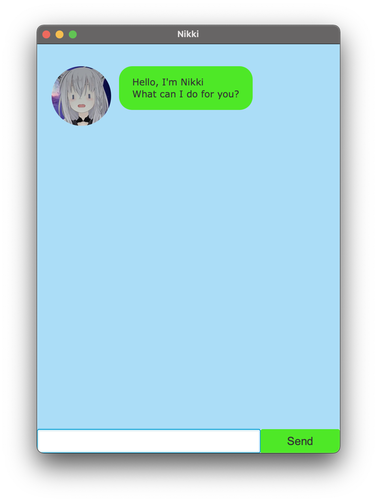

# User Guide

Nikki is a **desktop app for managing tasks**, utilizing a **Command Line Interface (CLI)** for swift operations for
fast typists, while still having a **Graphical User Interface (GUI)** for your task management to be pleasing to the
eye too!

> No more moving your hands to reach for the mouse, everything can be done with you 10 fingers on the keyboard!

 - [Quick start](#quick-start)
 - [Features](#features)
   - [Adding a ToDo: `todo`](#adding-a-todo-todo)
   - [Adding an Event: `event`](#adding-an-event-event)
   - [Adding a Deadline: `deadline`](#adding-a-deadline-deadline)
   - [Listing all tasks: `list`](#listing-all-tasks-list)
   - [Finding tasks: `find`](#finding-tasks-find)
   - [Marking a task as done: `mark`](#marking-a-task-as-done-mark)
   - [Marking a task as not done: `unmark`](#unmarking-a-task-as-not-done-unmark)
   - [Deleting a task: `delete`](#deleting-a-task-delete)
   - [Exiting the application: `bye`](#exiting-the-application-bye)
 - [FAQ](#faq)

---

## Quick Start
1. Ensure you have `Java 11` or above installed on your computer. If not, you may install it from
[here](https://www.oracle.com/java/technologies/downloads/#java11).
2. Download the latest version of `nikki.jar` [here](https://github.com/DavidTan0527/ip/releases/).
3. Copy the file to any folder you want. Note that the application will also store its data in this folder.
4. Double-click to start the app. A window similar to the picture below should pop up.

5. Type each of the following commands in the chat box and press Enter to execute it. Some examples you can try:

   1. `todo buy fruits` : Add a ToDo called "buy fruits"
   2. `todo wash clothes` : Add a ToDo called "wash clothes"
   3. `mark 2` : Mark second task as done
   4. `list` : Show everything in the list
   5. `bye` : Save the list and exit the program

6. Refer to the [Features](#features) section below to learn about more commands.

---

## Features 
> Words in `UPPERCASE` are the parameters to be supplied by the user. 
> e.g. in `todo NAME`, `NAME` is the parameter which can be supplied as `todo shower`.

### Adding a ToDo: `todo`
Adds a ToDo to the list.

Format: `todo NAME`

Examples:
- `todo buy groceries`
- `todo prepare ingredients for roast chicken`

 

### Adding an Event: `event`
Adds an Event (on a specific date) to the list.

Format: `event NAME /at DD/MM/YYYY`

Examples:
- `event concert /at 27/2/2022`
- `event award ceremony /at 6/10/2022`

 

### Adding a Deadline: `deadline`
Adds an Event (on a specific date) to the list.

Format: `deadline NAME /by DD/MM/YYYY`

Examples:
- `deadline progress report /by 25/2/2022`
- `deadline assignment 2 /by 2/3/2022`

 

### Listing all tasks: `list`
Lists all the tasks in the list. Shows the type, name, completion status of the task, and other possible details.

Format: `list`

 

### Find tasks: `find`
Finds tasks in the list whose names (partially) matches the user input.
> - Search is **case insensitive**.
> - Slight typos will **not** affect the search.

Format: `find PATTERN`

Examples:
- `find comp`  returns `fix computer`, `competition prep`
- `find Project` returns `science project`, `project meeting`
- `find prject` returns `science project`, `project meeting`

 

### Marking a task as done: `mark`
Marks a task as completed.

Format: `mark INDEX`

`INDEX` denotes what number the task is on the list. If `INDEX` is not a valid number on the list, the list will not be
updated.

Examples:
- `mark 2`

 

### Marking a task as not done: `unmark`
Marks a task as not completed.

Format: `unmark INDEX`

`INDEX` denotes what number the task is on the list. If `INDEX` is not a valid number on the list, the list will not be
updated.

Examples:
- `unmark 1`

 

### Deleting a task: `delete`
Deletes a task from the list.

Format: `delete INDEX`

`INDEX` denotes what number the task is on the list. If `INDEX` is not a valid number on the list, the list will not be
updated.

Examples:
- `delete 1`

 

### Clearing the list: `clear`
Clears all tasks from the list.

Format: `clear`

 

### Exiting the application: `bye`
Saves the current list to disk and exits the program.

Format: `bye`

 

---

## FAQ

**Q**: Where is the data stored? 
**A**: Through testing, it depends on the launcher used to run the program, the data might be stored in a "temp" folder 
created by the launcher itself. However, if you open the program in the terminal using `java -jar nikki.jar`, then the
data will be stored in the same directory as the JAR file is.

 

**Q**: How do I find my data if I'm not sure how my launcher behaves? 
**A**: Unfortunately, the developers do not have a good answer, as this is majorly system dependent. However, we
strongly suggest **not** to modify the data manually, as wrong formats will cause the data to not be loaded correctly.
So if you were locating the data file to do so, don't.

 

**Q**: What happens if the file is corrupted and my data is not loaded correctly? 
**A**: The program will start with an empty list again.

 

**Q**: Will my data be saved if I don't exit the program with `bye`? 
**A**: As of `v1.0.1`, the answer is **no**. However, future versions might contain such a feature.

 
